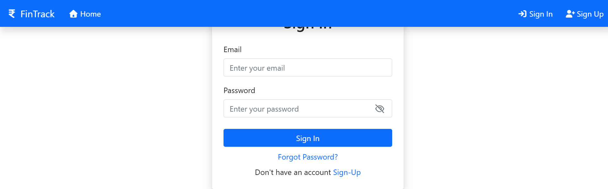
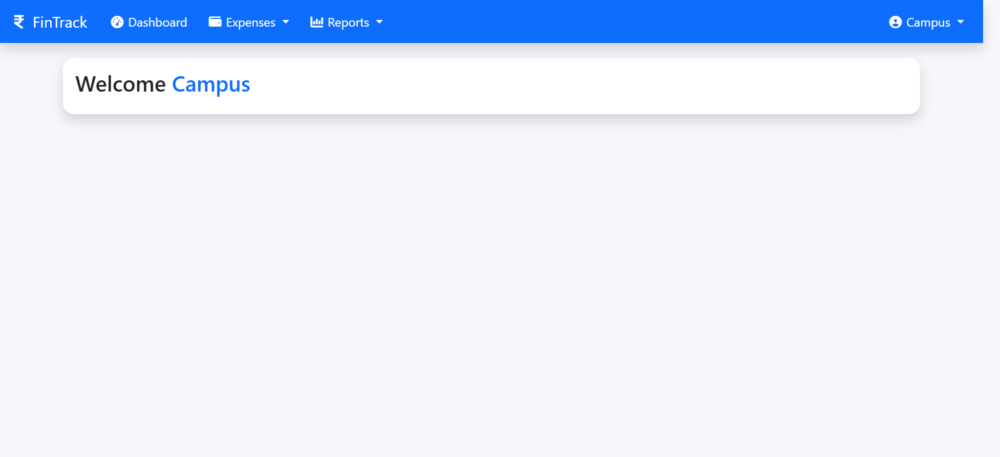
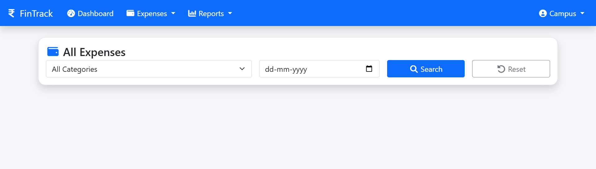
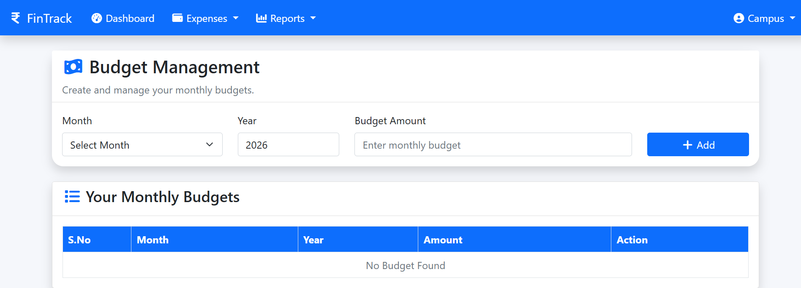
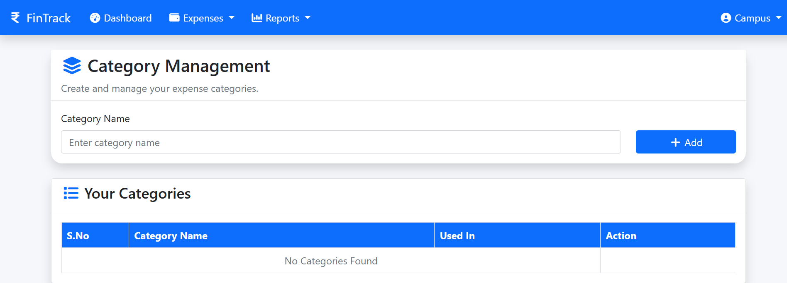
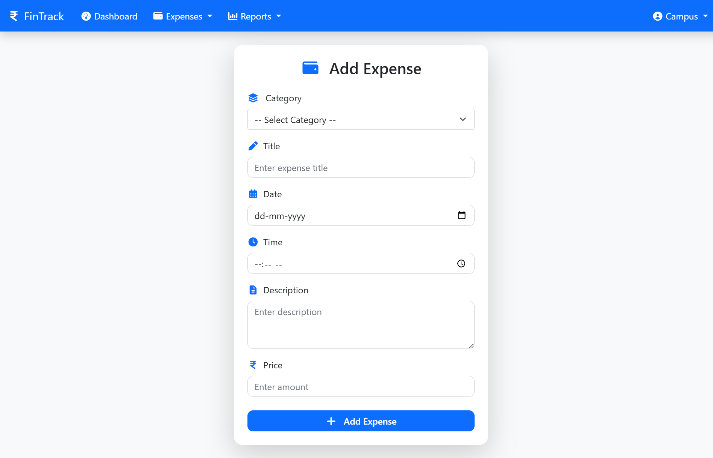

# 💰 FinTrack – Personal Expense Tracker

<p align="center">
  <strong>A secure and user-friendly personal expense management web application</strong>
</p>

<p align="center">
  Track Expenses • Manage Budgets • Analyze Spending • Generate Reports
</p>

---

## 📌 About the Project

**FinTrack** is a web-based **Personal Expense Tracker** developed using Java web technologies.

The application allows users to securely manage their daily expenses, organize expenses into categories, set monthly budgets, analyze spending patterns, generate monthly reports, and export financial information as PDF.

The project is built using **Java Servlets, JSP, Hibernate ORM, MySQL, Bootstrap, JavaScript, Chart.js, OpenPDF, and Brevo SMTP**.

FinTrack follows an **MVC-based architecture** to separate the presentation, request-handling, and database persistence layers.

---

## 🎯 Project Objectives

The main objectives of FinTrack are:

- Provide a simple platform for managing personal expenses.
- Allow users to organize expenses using categories.
- Help users set and monitor monthly budgets.
- Provide graphical expense analytics.
- Generate monthly expense reports.
- Export financial data as PDF.
- Implement secure user authentication.
- Provide password recovery through email.
- Demonstrate practical Java web application development.

---

# 🚀 Features

## 👤 User Management

FinTrack provides a complete user authentication and password-management system.

### Features

- User Registration
- User Login
- Secure Authentication
- Logout
- Authentication Filter
- BCrypt Password Hashing
- Forgot Password
- Password Reset using Email
- Password Reset Token
- Reset Token Expiration

---

## 💸 Expense Management

Users can manage their personal expenses using complete CRUD functionality.

### Features

- Add Expense
- View Expenses
- Edit Expense
- Delete Expense
- Search Expenses
- Store Expense Amount
- Store Expense Description
- Store Expense Date
- Store Expense Time
- Assign Categories to Expenses

### CRUD Flow

```text
Create → Add Expense
Read   → View / Search Expense
Update → Edit Expense
Delete → Delete Expense
```

---

## 🏷️ Category Management

Users can organize their expenses by creating and managing categories.

### Features

- Create Categories
- View Categories
- Update Categories
- Delete Categories
- Assign Categories to Expenses

### Example Categories

```text
Food
Travel
Shopping
Bills
Education
Entertainment
Healthcare
Other
```

---

## 📊 Dashboard & Analytics

The FinTrack dashboard provides a centralized overview of the user's financial activity.

### Dashboard Information

- Total Expenses
- Today's Expenses
- Current Month Expenses
- Total Expense Records
- Recent Expenses
- Monthly Budget
- Remaining Budget
- Expense Analytics
- Monthly Expense Chart

The dashboard helps users quickly understand their current spending and budget status.

---

## 💰 Budget Management

FinTrack allows users to create and monitor monthly budgets.

### Features

- Create Monthly Budget
- Update Budget
- Delete Budget
- One Budget per Month per User
- Remaining Budget Calculation
- Budget Integration with Dashboard

### Example

```text
Monthly Budget    : ₹20,000
Monthly Expenses  : ₹14,500
Remaining Budget  : ₹5,500
```

---

## 📄 Reports & PDF

FinTrack provides reporting and PDF export functionality.

### Features

- Monthly Expense Reports
- Expense Summary
- Monthly Financial Reports
- PDF Expense Export
- Financial Statement-style PDF Report

---

## 📧 Email Services

The Forgot Password functionality uses **Brevo SMTP** for sending password-reset emails.

### Features

- Forgot Password Email
- Password Reset Link
- SMTP Integration
- Brevo SMTP Relay

### Password Reset Flow

```text
Forgot Password
       ↓
Enter Registered Email
       ↓
Generate Reset Token
       ↓
Send Password Reset Email
       ↓
Open Reset Link
       ↓
Create New Password
       ↓
Password Updated
```

---

## 🎨 User Interface

FinTrack provides a responsive and user-friendly interface.

### UI Features

- Responsive Bootstrap UI
- Modern Dashboard
- Navigation Bar
- Search Interface
- Charts and Analytics
- Responsive Design
- User-friendly Forms

---

# 🛠️ Technologies Used

| Technology | Purpose |
|---|---|
| **Java** | Backend Programming |
| **Java Servlets** | Request Handling and Controller Logic |
| **JSP** | Dynamic Web Pages |
| **Hibernate ORM** | Object-Relational Mapping and Database Interaction |
| **MySQL** | Relational Database |
| **HTML5** | Frontend Structure |
| **CSS3** | Styling |
| **JavaScript** | Client-side Functionality |
| **Bootstrap** | Responsive User Interface |
| **Chart.js** | Expense Analytics and Charts |
| **Maven** | Dependency Management |
| **OpenPDF** | PDF Generation |
| **Brevo SMTP** | Email / Password Reset Service |
| **Apache Tomcat** | Application Server |
| **Eclipse / Spring Tool Suite** | Development Environment |
| **Git & GitHub** | Version Control |

---

# 🏗️ Project Architecture

FinTrack follows an **MVC-style architecture**.

```text
                       ┌─────────────────────┐
                       │       Browser       │
                       │       / User        │
                       └──────────┬──────────┘
                                  │
                                  ▼
                       ┌─────────────────────┐
                       │      JSP / HTML     │
                       │     Bootstrap UI    │
                       │  Presentation Layer │
                       └──────────┬──────────┘
                                  │
                                  ▼
                       ┌─────────────────────┐
                       │      Servlets       │
                       │   Controller Layer  │
                       └──────────┬──────────┘
                                  │
                                  ▼
                       ┌─────────────────────┐
                       │      Hibernate      │
                       │      ORM Layer      │
                       └──────────┬──────────┘
                                  │
                                  ▼
                       ┌─────────────────────┐
                       │        MySQL        │
                       │       Database      │
                       └─────────────────────┘
```

### Architecture Flow

```text
User
 ↓
JSP / UI
 ↓
Servlet
 ↓
Application Logic
 ↓
Hibernate
 ↓
MySQL
```

---

# 📁 Project Structure

A simplified project structure looks like this:

```text
FinTrack/
│
├── src/
│   └── main/
│       ├── java/
│       │   └── com/
│       │       └── shikhar/
│       │           │
│       │           ├── bean/
│       │           │   ├── User.java
│       │           │   ├── Expense.java
│       │           │   ├── Category.java
│       │           │   └── Budget.java
│       │           │
│       │           ├── servlet/
│       │           │   ├── LoginServlet.java
│       │           │   ├── RegisterServlet.java
│       │           │   ├── AddExpenseServlet.java
│       │           │   ├── ViewExpenseServlet.java
│       │           │   ├── EditExpenseServlet.java
│       │           │   ├── DeleteExpenseServlet.java
│       │           │   ├── ManageBudgetServlet.java
│       │           │   ├── ExportPdfServlet.java
│       │           │   └── ...
│       │           │
│       │           ├── filter/
│       │           │   └── AuthenticationFilter.java
│       │           │
│       │           └── utility/
│       │               ├── HbUtility.java
│       │               ├── PdfGenerator.java
│       │               └── ...
│       │
│       └── webapp/
│           ├── index.jsp
│           ├── login.jsp
│           ├── register.jsp
│           ├── UserHome.jsp
│           ├── ViewExpense.jsp
│           ├── Budget.jsp
│           ├── MonthlyReport.jsp
│           ├── css/
│           ├── js/
│           └── ...
│
├── pom.xml
├── README.md
└── ...
```

> **Note:** The exact package and file structure may vary depending on the current version of the project.

---

# ⚙️ Prerequisites

Before running FinTrack, make sure the following software is installed.

### Required Software

- **JDK 17 or the Java version configured in the project**
- **MySQL Server**
- **MySQL Workbench** *(recommended)*
- **Apache Tomcat**
- **Eclipse IDE for Enterprise Java** or **Spring Tool Suite**
- **Git**
- **Maven** *(if Maven is not bundled/configured through your IDE)*

---

## 1. Check Java

Open Git Bash or Command Prompt:

```bash
java -version
```

Make sure Java is installed and available in your system PATH.

---

## 2. Check Git

```bash
git --version
```

---

## 3. Check Maven

```bash
mvn -version
```

---

# 📥 Clone the Project from GitHub

The FinTrack repository is available on GitHub:

**Repository:**  
https://github.com/ShikharSingh13/FinTrack

Open Git Bash or Command Prompt and run:

```bash
git clone https://github.com/ShikharSingh13/FinTrack.git
```

Move into the project directory:

```bash
cd FinTrack
```

You now have a local copy of the project.

---

# 📂 Import the Project into Eclipse / STS

After cloning the repository:

### Step 1

Open **Eclipse** or **Spring Tool Suite**.

### Step 2

Go to:

```text
File → Import
```

### Step 3

Select:

```text
Maven → Existing Maven Projects
```

Click **Next**.

### Step 4

Select the cloned **FinTrack** project directory.

Eclipse should automatically detect:

```text
pom.xml
```

### Step 5

Click:

```text
Finish
```

Wait for Maven to download all required dependencies.

---

# 🗄️ Database Setup

FinTrack uses **MySQL** as its database.

The application is configured to use the database:

```text
expensedb
```

Open **MySQL Workbench** or MySQL Command Line and create the database:

```sql
CREATE DATABASE expensedb;
```

Verify the database:

```sql
SHOW DATABASES;
```

You should see:

```text
expensedb
```

> Hibernate can also create/update the required tables according to the project's Hibernate configuration.

---

# 🔧 Configure Database Connection

Open the database/Hibernate configuration used by the project, such as:

```text
src/main/java/com/shikhar/utility/HbUtility.java
```

Configure your local MySQL credentials.

The configuration should point to:

```text
jdbc:mysql://localhost:3306/expensedb
```

Example:

```java
jdbc:mysql://localhost:3306/expensedb?createDatabaseIfNotExist=true
```

Set your MySQL username and password according to your local MySQL installation.

For example:

```text
Username: root
Password: YOUR_MYSQL_PASSWORD
```

Replace:

```text
YOUR_MYSQL_PASSWORD
```

with your actual local MySQL password.

---

# ⚠️ Important: Protect Your Credentials

**Never upload real passwords, API keys, SMTP keys, or other secrets to GitHub.**

Do not commit values such as:

```text
MySQL Password
Brevo SMTP Key
API Keys
Secret Keys
Private Credentials
```

Use environment variables or external configuration whenever possible.

---

# 📧 Email / Brevo SMTP Configuration

FinTrack's **Forgot Password** functionality uses **Brevo SMTP** to send password-reset emails.

The application uses the following environment variables:

```text
BREVO_SMTP_LOGIN
BREVO_SMTP_KEY
BREVO_SENDER_EMAIL
```

The SMTP host and port are configured by the application.

### Example

```text
BREVO_SMTP_LOGIN=your_brevo_login
BREVO_SMTP_KEY=your_brevo_smtp_key
BREVO_SENDER_EMAIL=your_verified_sender_email
```

> Do not replace these example values with real credentials inside this README or commit them to GitHub.

---

# 🔐 Configure Environment Variables on Windows

You can configure the environment variables through Windows.

### Method 1: Windows Environment Variables

1. Open **Windows Search**.
2. Search for:
   **Environment Variables**
3. Select:
   **Edit the system environment variables**
4. Click:
   **Environment Variables**
5. Under **User variables**, click **New**.
6. Add:

```text
Variable name:
BREVO_SMTP_LOGIN

Variable value:
YOUR_BREVO_LOGIN
```

Add the remaining variables:

```text
BREVO_SMTP_KEY
BREVO_SENDER_EMAIL
```

7. Click **OK**.
8. Restart Eclipse / STS.

---

## Method 2: Git Bash

For the current Git Bash session:

```bash
export BREVO_SMTP_LOGIN="YOUR_BREVO_LOGIN"
export BREVO_SMTP_KEY="YOUR_BREVO_SMTP_KEY"
export BREVO_SENDER_EMAIL="YOUR_SENDER_EMAIL"
```

Verify:

```bash
echo $BREVO_SMTP_LOGIN
```

> Never commit your actual SMTP credentials to GitHub.

---

# 📦 Maven Dependencies

FinTrack uses **Maven** for dependency management.

All required dependencies are defined in:

```text
pom.xml
```

After importing the project, Maven should automatically download the required dependencies.

If dependencies are not downloaded correctly:

```text
Right Click Project
        ↓
Maven
        ↓
Update Project
```

Then select:

```text
Force Update of Snapshots/Releases
```

Click **OK**.

---

# ▶️ Run the Application

After completing the database and environment configuration:

### Step 1

Right-click the project.

### Step 2

Select:

```text
Run As → Run on Server
```

### Step 3

Select your configured **Apache Tomcat Server**.

### Step 4

Click:

```text
Finish
```

Tomcat should start and deploy FinTrack.

---

# 🌐 Open the Application

Once Tomcat is running, open your browser:

```text
http://localhost:8080/FinTrack/
```

Depending on your Tomcat configuration, the context path or port may be different.

---

# 👤 Using the Application

Once FinTrack is running:

### 1. Register

Create a new user account.

### 2. Login

Login using your registered credentials.

### 3. Dashboard

After login, the dashboard displays information such as:

- Total Expenses
- Today's Expenses
- Monthly Expenses
- Budget Information
- Remaining Budget
- Recent Expenses
- Expense Analytics

### 4. Add Expense

Enter:

- Amount
- Category
- Description
- Date
- Time

Then save the expense.

### 5. Manage Expenses

Users can:

- View expenses
- Search expenses
- Edit expenses
- Delete expenses

### 6. Manage Categories

Create and manage expense categories.

### 7. Manage Budget

Set a monthly budget and track the remaining amount.

### 8. Generate Reports

Generate monthly expense reports.

### 9. Export PDF

Export financial information as a PDF report.

---

# 📊 Expense Analytics

FinTrack provides graphical analytics to help users understand their spending patterns.

The dashboard provides information such as:

```text
Total Expenses
Today's Expenses
Monthly Expenses
Monthly Budget
Remaining Budget
```

Charts and visualizations are implemented using **Chart.js**.

---

# 🔑 Forgot Password

If you forget your password:

```text
Open Forgot Password
        ↓
Enter Registered Email
        ↓
Generate Reset Token
        ↓
Send Email
        ↓
Open Reset Link
        ↓
Create New Password
        ↓
Login
```

The password reset token is designed to expire after a limited period.

The email functionality requires valid Brevo SMTP configuration.

---

# 🧾 PDF Export

FinTrack uses **OpenPDF** to generate financial PDF reports.

Generated reports can contain information such as:

- User information
- Expense details
- Categories
- Dates
- Amounts
- Total expenses
- Monthly summary

The PDF is designed in a financial-statement style.

---

# 🔒 Security Considerations

FinTrack includes several security-related features:

- BCrypt password hashing
- Authentication Filter
- Session-based authentication
- Protected application pages
- Password reset tokens
- Token expiration
- Environment variables for SMTP credentials

For production deployment, additional security measures should be considered, including:

- HTTPS
- CSRF protection
- Secure cookies
- Stronger input validation
- Production-grade secret management
- Database access restrictions
- Additional authorization controls

---

# 🐛 Common Problems & Solutions

## 1. Database Connection Error

### Possible Error

```text
Communications link failure
```

### Check

- MySQL Server is running.
- Database `expensedb` exists.
- MySQL username is correct.
- MySQL password is correct.
- Database URL is correct.

Example:

```text
jdbc:mysql://localhost:3306/expensedb
```

---

## 2. Maven Dependencies Not Downloading

Try:

```text
Right Click Project
        ↓
Maven
        ↓
Update Project
```

Then select:

```text
Force Update of Snapshots/Releases
```

---

## 3. 404 Error

If you see:

```text
HTTP Status 404
```

Check:

- Tomcat is running.
- FinTrack is deployed to Tomcat.
- Correct application URL is being used.
- Servlet mappings are correct.
- The project context path is correct.

---

## 4. Port 8080 Already in Use

If Tomcat shows:

```text
Port 8080 required by Tomcat is already in use
```

Stop the application currently using port 8080 or change the Tomcat port.

For example:

```text
8080 → 8081
```

Then use:

```text
http://localhost:8081/FinTrack/
```

---

## 5. Forgot Password Email Not Working

Check:

- Brevo SMTP login
- Brevo SMTP key
- Sender email
- Environment variable names
- Environment variable values
- Internet connection
- Brevo account configuration

Make sure the sender email is configured correctly with your email service.

---

# 🔄 Updating the Project

If new changes are pushed to the repository, update your local copy using:

```bash
git pull origin main
```

After pulling changes, refresh Maven if required:

```text
Right Click Project
        ↓
Maven
        ↓
Update Project
```

---

# 📤 Uploading Your Changes to GitHub

If you are the project owner and want to upload your changes:

### Check project status

```bash
git status
```

### Add changes

```bash
git add .
```

### Create a commit

```bash
git commit -m "Update FinTrack features"
```

### Push changes

```bash
git push origin main
```

---

# 🧹 Recommended `.gitignore`

The project should ignore generated files, IDE metadata, logs, and environment files.

Example:

```gitignore
# Maven
target/

# Eclipse
.classpath
.project
.settings/

# STS
.springBeans

# IntelliJ IDEA
.idea/
*.iml

# VS Code
.vscode/

# Logs
*.log

# Environment files
.env
.env.*

# OS files
.DS_Store
Thumbs.db
```

---

# 🧪 Testing Checklist

## Authentication

- [ ] Register a new user
- [ ] Login
- [ ] Logout
- [ ] Try accessing protected pages without login
- [ ] Forgot password
- [ ] Receive reset email
- [ ] Reset password
- [ ] Login with new password

## Expenses

- [ ] Add expense
- [ ] View expenses
- [ ] Search expenses
- [ ] Edit expense
- [ ] Delete expense

## Categories

- [ ] Add category
- [ ] View categories
- [ ] Update category
- [ ] Delete category
- [ ] Assign category to expense

## Budget

- [ ] Create monthly budget
- [ ] Update budget
- [ ] Delete budget
- [ ] Check remaining budget
- [ ] Try creating duplicate monthly budget

## Reports

- [ ] Generate monthly report
- [ ] Verify report data
- [ ] Export PDF
- [ ] Verify PDF content

## Analytics

- [ ] Check total expenses
- [ ] Check today's expenses
- [ ] Check monthly expenses
- [ ] Check budget
- [ ] Check remaining budget
- [ ] Verify charts

---

# 📸 Screenshots

Screenshots can be added here to showcase the application.

Recommended screenshots:

### Home Page


### Login Page



### Dashboard



### Expense Management



### Budget Management



### Expense Analytics



### Monthly Report



> **Note:** Create a `screenshots` folder in the repository and add the corresponding images before using these paths.

---


# 🎓 Learning Objectives

This project demonstrates practical implementation of:

### Java

- Object-Oriented Programming
- Exception Handling
- Collections
- Date and Time API

### Java Web Development

- Java Servlets
- JSP
- HTTP Requests and Responses
- Sessions
- Filters
- MVC Architecture

### Hibernate

- ORM
- Entity Mapping
- CRUD Operations
- Hibernate Sessions
- Database Relationships

### MySQL

- Database Design
- SQL
- Primary Keys
- Foreign Keys
- Relationships
- Data Persistence

### Frontend

- HTML5
- CSS3
- Bootstrap
- JavaScript
- Chart.js
- Responsive UI

### Additional Technologies

- Maven
- BCrypt
- OpenPDF
- SMTP
- Git
- GitHub
- Environment Variables

---


# 📄 License

This project is created for **educational and learning purposes**.

You are free to explore, modify, and improve the project for your learning and development.

---

# 👨‍💻 Author

## Shikhar Singh

**Java Developer | Spring Boot | Hibernate | MySQL | Web Development**

### GitHub

https://github.com/ShikharSingh13

### FinTrack Repository

https://github.com/ShikharSingh13/FinTrack

---

# ⭐ Support

If you find FinTrack useful or helpful for learning Java web development, consider giving the repository a ⭐ on GitHub.

---

# 💰 FinTrack

> **Track your expenses. Manage your budget. Understand your spending.**

<p align="center">
  Made with ❤️ using Java
</p>
